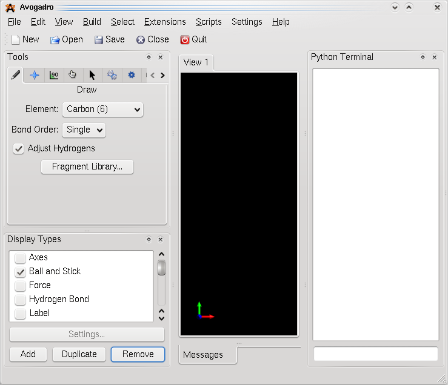
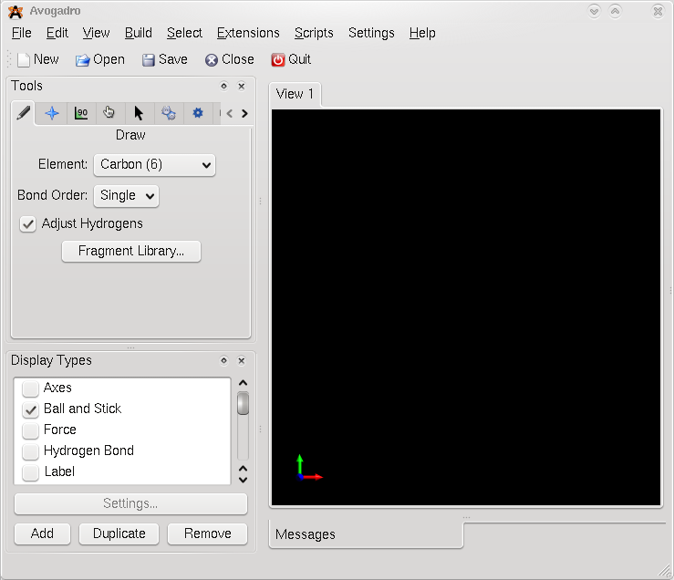
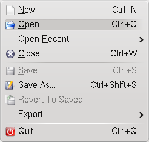
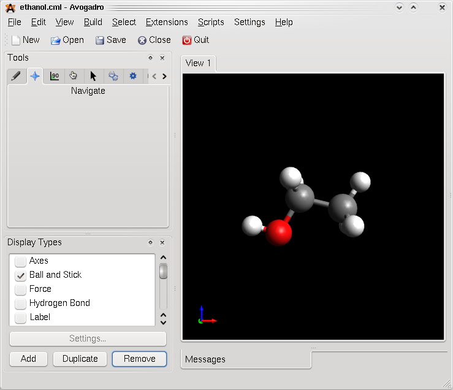
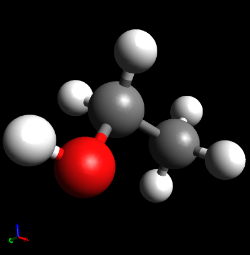

# Tutorials:Getting started

When you initially open Avogadro you will be presented with a screen such as the one shown below (Avogadro 0.8.1 on KDE 4.1).

You will probably not need the Python terminal and so can safely close it by clicking on the small cross in the top right of the Python terminal dock window. You should be left with something like the screen shot below.

Opening a File
--------------

The first thing you will probably want to do is open a file and navigate around the molecule. To do this click on the File menu and select Open.

You can then look through the files on your disk and find an appropriate chemical file. Thanks to Avogadro's use of OpenBabel a large number of file types are supported including CML, xyz, PDB etc. Several example molecules are supplied in the Avogadro source tarball.

The screen shot above shows the ethanol.cml file opened up and displayed using the default [Ball and Stick](Ball and Stick "wikilink") display type. Notice that when a new file is opened Avogadro switches from the [Draw Tool](Draw Tool "wikilink") to the [Navigate Tool](Navigate Tool "wikilink").

Navigation
----------

You can zoom in/out using the scroll wheel on your mouse or holding down the middle mouse button and moving the mouse cursor up/down. You can rotate the view by holding down the left mouse button and moving the mouse cursor. You can also translate the view by holding down the right mouse button and moving the mouse cursor.

Note: if your mouse only has one or two buttons you can also use the modifier keys (shift and control) along with the left mouse button to perform actions where you would normally use the middle or right mouse buttons respectively.

Rendering Quality
-----------------

The screen shots above were produced by exporting the graphics (File-\>Export-\>Export Graphics). The first image (leftmost) shows the scene after navigation at the lowest quality setting. The middle image shows it at medium quality setting and the final image (rightmost/bottom) shows the molecule rendered using the highest quality setting.

The quality of rendering can be adjusted in the Settings menu by selecting 'Configure Avogadro...' The slider has five quality levels. As the quality is increased the global quality of all rendering is increased. At the highest two quality levels a second light source is also used. The higher the quality the more CPU/GPU power will be used to render the scene.

<Category:Tutorials>

